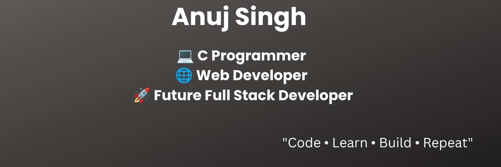

<!-- Banner -->

  

<h1 align="center">
Hi 👋, I'm Anuj Singh
</h1>

<h3 align="center">
💻 C Programmer | 🌐 Web Developer | 🚀 Future Full Stack Developer
</h3>

---

# 👨‍💻 About Me

🎓 First Year Student

🌱 Currently Learning

- C Programming
- HTML
- CSS
- JavaScript
- Git & GitHub

🎯 Goal

Become a Full Stack Developer and Software Engineer.

💡 I love solving programming problems and building projects.

📫 Reach Me

your-email@example.com

---

# 🚀 Tech Stack

---

# 📚 Currently Learning

⭐ C Programming

⭐ Web Development

⭐ Git & GitHub

🔜 Python

🔜 DSA

🔜 React

---

# 🎯 2026 Goals

✅ Master C

✅ Learn Python

✅ Learn DSA

✅ Build 30+ Projects

✅ Build Portfolio Website

✅ Open Source Contribution

✅ Become Full Stack Developer
